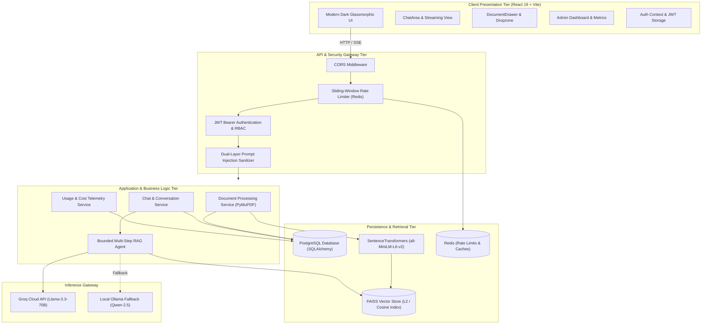
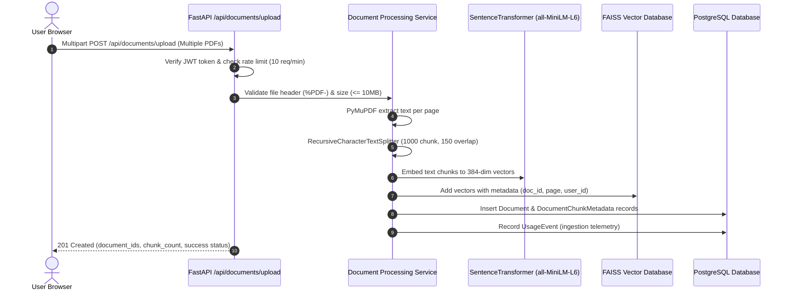
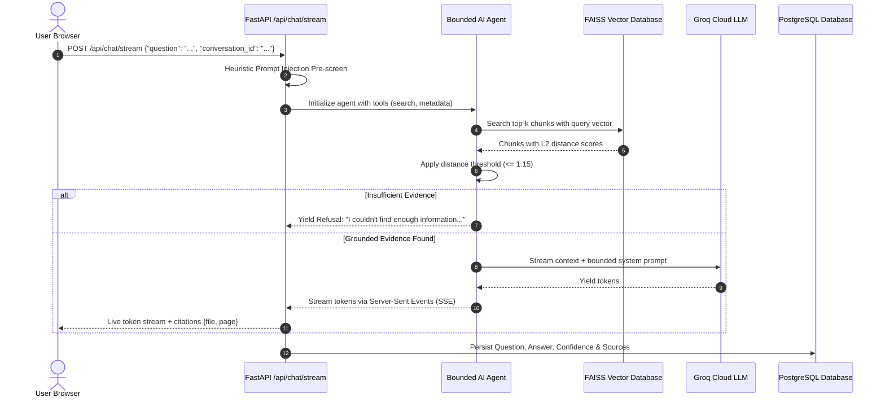

# High-Level Design (HLD) — SecureRAG

**Project Name:** SecureRAG — Private Multi-Document AI Knowledge Assistant  
**Author:** Sri Sanjay R (Kalvium Community: sanjay.s.s.140@kalvium.community)  
**Version:** 1.0.0  
**Target Environment:** Production (Render Backend + PostgreSQL + Redis / Vercel Frontend)  

---

## 1. System Overview & Architecture Diagram

SecureRAG is engineered as a decoupled, micro-service oriented architecture consisting of a client-side Single Page Application (SPA), a high-performance ASGI REST backend, an embedding and vector retrieval engine, relational persistence, in-memory caching/rate-limiting, and an external LLM reasoning gateway.

---

## 2. Component Deconstruction

### 2.1 Presentation Tier (Frontend)
- **Framework:** React 19 bootstrapped with Vite v8.
- **Styling & Effects:** Tailwind CSS with Framer Motion animations and Lucide React iconography.
- **Key Modules:**
  - `App.jsx`: Root state coordinator managing view toggling (`chat`, `documents`, `admin`), global modals, and notifications.
  - `Navbar.jsx`: Global header providing system health badges, document counters, and the primary glowing "Upload Documents" action.
  - `Sidebar.jsx`: Responsive drawer displaying conversation history, "New Chat" actions, and the "Knowledge Base" card with live document count.
  - `ChatArea.jsx`: Renders message bubbles, glowing thinking orbs, page-level citation pills, copy-to-clipboard actions, and auto-expanding input composer.
  - `DocumentDrawer.jsx`: Multi-PDF drag-and-drop zone with file size/page/chunk metadata cards and document deletion capabilities.
  - `AdminDashboard.jsx`: Live system analytics displaying registered users, document count, token consumption, cost in USD, and response latencies.
  - `AuthModal.jsx`: Modal for JWT authentication (Login / Register) with client-side field validation.

### 2.2 API & Security Gateway Tier (FastAPI)
- **Framework:** FastAPI 0.115+ running on Uvicorn ASGI server with Python 3.14.
- **Rate Limiter:** Custom sliding-window rate limiter using Redis with an in-memory deque fallback. Returns HTTP 429 when thresholds are exceeded.
- **Security Sanitizer:** Pre-screens inputs against adversarial jailbreaks, system override prompts, and roleplay exploits.
- **Authentication & RBAC:** Salting and hashing via direct `bcrypt` (`gensalt(12)`). JWT tokens signed with `HS256`, verified via FastAPI dependency injection (`Depends(get_current_user)`).

### 2.3 Document Processing & Embedding Pipeline
- **Extraction:** PyMuPDF (`fitz`) handles multi-page text extraction with UTF-8 character normalization.
- **Chunking:** LangChain `RecursiveCharacterTextSplitter` segments text into 1000-character segments with 150-character overlap.
- **Embedding:** `sentence-transformers/all-MiniLM-L6-v2` maps chunks into 384-dimensional dense vector representations.
- **Vector Storage:** FAISS (`IndexFlatL2` / `IndexFlatIP`) stores embeddings with document and page metadata tags.

### 2.4 Inference & Agentic Reasoning Tier
- **Agent Architecture:** Multi-step autonomous agent with bounded iterations ($\le 3$).
- **Function Calling Tools:**
  1. `tool_search_documents(query, k)`: Executes vector similarity search with distance threshold filtering ($\le 1.15$).
  2. `tool_list_documents()`: Lists available documents in the knowledge base.
  3. `tool_get_document_metadata(doc_id)`: Fetches page counts, chunk counts, and timestamps.
- **Model Providers:**
  - Primary: Groq API (`llama-3.3-70b-versatile` / `mixtral-8x7b-32768`) for sub-second inference.
  - Fallback: Local Ollama daemon (`qwen2.5:3b` / `llama3.2`) for offline or air-gapped environments.

---

## 3. Data Flow Diagrams

### 3.1 Ingestion Flow (PDF to FAISS & PostgreSQL)

### 3.2 Query & Streaming Synthesis Flow

---

## 4. Deployment Architecture

| Tier | Provider / Tech | Scaling & Redundancy |
| :--- | :--- | :--- |
| **Frontend Web** | Vercel (Edge CDN) | Global CDN caching, instant HTTPS, SPA rewrites |
| **Backend API** | Render / Docker Container | Python 3.14 Uvicorn ASGI, auto-restart |
| **Relational Database** | Managed PostgreSQL (Neon / Supabase / Render) | Connection pooling, automated backups, SQLite fallback |
| **In-Memory Cache** | Upstash Redis / Local Redis | In-memory key-value eviction, fallback to local deque |
| **Vector Database** | FAISS FlatL2 (In-memory + disk snapshot) | Ephemeral in RAM with snapshot persistence |
