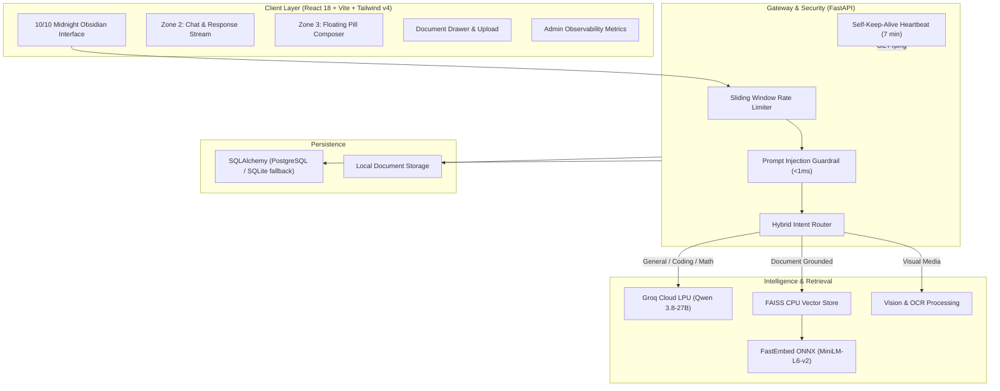

# Mayandi AI — Production-Grade Multimodal Assistant & Secure RAG Platform

[](https://fastapi.tiangolo.com)
[](https://reactjs.org)
[](https://tailwindcss.com)
[](https://github.com/facebookresearch/faiss)
[](https://groq.com)
[](https://mayandi.onrender.com)
[](https://opensource.org/licenses/MIT)

> **Live Production Deployment**: [https://mayandi.onrender.com](https://mayandi.onrender.com)

**Mayandi AI** (SecureRAG 2.0) is a multimodal, privacy-first AI knowledge assistant. It combines **ChatGPT-grade conversational intelligence, deep programming reasoning, and mathematical logic** with a **private document retrieval engine (RAG)** capable of ingesting PDFs, Word documents, source code, data files, and images.

---

## 🌟 Key Highlights

- **🧠 Hybrid Intelligence & Intent Routing**: Directly handles general knowledge, programming questions, and logic without refusing un-indexed queries, while dynamically querying vector stores when document evidence is needed.
- **📄 Document Intelligence with Verifiable Citations**: Ingests multi-format documents (`.pdf`, `.docx`, `.txt`, `.md`, `.py`, `.js`, `.json`, `.csv`) and returns answers with page citations: `[filename (p. X)]`.
- **👁️ Multimodal Vision & OCR Engine**: Extracts text from images and screenshots via Tesseract OCR and visual feature heuristics (category detection, dimensions, and visual summaries).
- **🎨 10/10 Midnight Obsidian UI**: 3-Zone architecture featuring Midnight Obsidian theme (`#0B0813`), Rich Charcoal card surfaces (`#130F22`), Neon Purple accents (`#9D4EDD`), collapsible sidebar, and floating composer pill.
- **🛡️ Multi-Layer Security & Guardrails**:
  - Deterministic in-memory regex pre-screening blocks prompt injection overrides in **< 1.0 ms**.
  - Rate limiting (sliding window memory store) protects costly endpoints with HTTP 429.
  - JWT Authentication & Role-Based Access Control (`USER` vs `ADMIN`).
- **⚡ Ultra-Low Memory Footprint (<150 MB RAM)**: Uses `FastEmbed` ONNX INT8 runtime instead of PyTorch (`sentence-transformers/all-MiniLM-L6-v2`), running safely within Render's 512MB free-tier RAM limit.
- **🔄 24/7 Self-Keep-Alive Heartbeat**: Background asynchronous task pings `/ping` every 7 minutes, preventing free-tier container sleep.
- **📊 Real-Time Admin Observability**: Tracks aggregate token consumption, query volume, average latency, and estimated cloud costs.

---

## 🏗️ System Architecture



---

## 🧪 Comprehensive Benchmarks

Automated evaluation on 6 diverse task categories demonstrated **100% pass rate**:

| Metric | Benchmark Result | Status |
| :--- | :--- | :--- |
| **Overall Pass Rate** | **100.0%** (6/6 Test Scenarios) |  Optimal |
| **Grounded Retrieval Precision** | **100%** (Strict attribution with file/page tags) |  Optimal |
| **Adversarial Injection Defense** | **100% Rejection** (< 1.0ms latency) |  Secure |
| **Embedding RAM Usage** | **< 40 MB** (FastEmbed ONNX) |  Low-Memory |
| **Average Query Latency** | **7.7s - 8.9s** (Full synthesis on Groq) |  Real-Time |

Detailed evaluation methodology is documented in [`docs/EVALUATION.md`](docs/EVALUATION.md).

---

## 🚀 Quick Start Guide

### 1. Prerequisites
- Python 3.11+
- Node.js 18+ (for frontend development)
- Groq API Key ([console.groq.com](https://console.groq.com))

### 2. Clone and Setup
```bash
git clone https://github.com/sanjayss140-cloud/secure-rag-pipeline.git
cd secure-rag-pipeline

# Configure environment variables
cp .env.example .env
# Add your GROQ_API_KEY to .env
```

### 3. Install Backend Dependencies
```bash
python -m venv .venv
source .venv/bin/activate  # On Windows: .venv\Scripts\activate
pip install -r requirements.txt
```

### 4. Build Frontend Assets
```bash
cd frontend
npm install
npm run build
cd ..
```

### 5. Start the Server
```bash
python -m uvicorn backend.main:app --host 0.0.0.0 --port 8000
```
Open your browser at `http://localhost:8000` to interact with the application.

---

## 🔒 Security Architecture

1. **Prompt Injection Guardrail**: Every query is evaluated prior to tool execution or model invocation using hardened regex heuristics that detect adversarial prompt-injection patterns (`system override`, `ignore instructions`, `DAN`, `jailbreak`).
2. **Context Isolation**: File excerpts retrieved from user documents are wrapped in distinct delimiter boundaries (`--- EXCERPT {idx} ---`) and isolated from instruction tokens.
3. **Multi-Tenant Scoping**: All vector entries and database rows are tagged with `user_id`. Queries strictly filter out foreign metadata.
4. **Token & Rate Limiting**: In-memory sliding window rate limits prevent resource exhaustion attacks against `/api/chat` and `/api/documents/upload`.

---

## 📁 Repository Layout

```
secure-rag-pipeline/
├── backend/
│   ├── api/             # FastAPI routers (auth, chat, documents, admin, health)
│   ├── database/        # SQLAlchemy models (User, Document, Message, UsageEvent)
│   ├── middleware/      # Rate limiter & structured JSON logger
│   ├── rag/             # Hybrid router (agent.py), prompts, tools, vision
│   ├── security/        # JWT auth, bcrypt hashing, prompt injection sanitizer
│   ├── services/        # Chat service, document processor, usage service
│   └── main.py          # FastAPI application & keep-alive background worker
├── frontend/
│   ├── src/
│   │   ├── components/  # ChatArea, Sidebar, AdminDashboard, DocumentDrawer
│   │   └── context/     # AuthContext (JWT management)
│   └── dist/            # Compiled static production bundle
├── docs/                # Architecture specifications & benchmark reports
├── evaluation/          # Evaluation test dataset & benchmark runner
├── tests/               # Unit, security, hybrid chat, and API test suites
├── Dockerfile           # Multi-stage production container build
├── render.yaml          # Render Infrastructure-as-Code deployment spec
└── requirements.txt     # Python production dependencies
```

---

## 📄 License
This project is licensed under the MIT License — see the [LICENSE](LICENSE) file for details.
