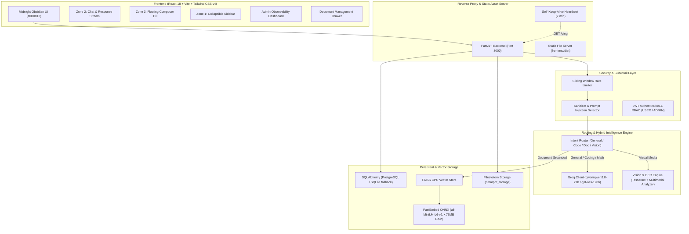

# Mayandi AI — Current Architecture & System Specification

## 1. System Overview
**Mayandi AI** (SecureRAG 2.0) is a production-grade, privacy-first, multimodal AI assistant and document intelligence platform. It combines general-purpose ChatGPT-grade conversational intelligence, deep reasoning, and code synthesis with a secure Retrieval-Augmented Generation (RAG) engine that indexes user-uploaded multi-format documents (PDF, DOCX, TXT, MD, CSV, JSON, code files, and images).

The application is deployed live at: `https://mayandi.onrender.com`

---

## 2. High-Level Architecture



---

## 3. Directory & Module Structure

```
secure-rag-pipeline/
├── backend/
│   ├── api/
│   │   ├── admin_routes.py       # GET /api/admin/stats (RBAC ADMIN)
│   │   ├── auth_routes.py        # POST /api/auth/register, /login, GET /me
│   │   ├── chat_routes.py        # POST /api/chat, GET /api/chat/stream, /conversations
│   │   ├── document_routes.py    # POST /api/documents/upload, GET, DELETE /api/documents/{id}
│   │   └── health_routes.py      # GET /api/health, /ping
│   ├── database/
│   │   ├── models.py             # User, Document, DocumentChunkMetadata, Conversation, Message, UsageEvent
│   │   └── session.py            # SQLAlchemy engine, session maker, PostgreSQL & SQLite auto-detect
│   ├── middleware/
│   │   ├── logging.py            # Structured request/response logging
│   │   └── rate_limiter.py       # In-memory sliding-window IP/user rate limiter
│   ├── rag/
│   │   ├── agent.py              # Multi-step agent workflow, intent routing, context assembly
│   │   ├── prompts.py            # ChatGPT-grade system prompt & document grounding template
│   │   ├── tools.py              # tool_list_documents, tool_search_documents
│   │   └── vision.py             # Vision processing & multimodal heuristic engine
│   ├── security/
│   │   ├── auth.py               # Password hashing (bcrypt), JWT creation & validation
│   │   └── sanitizer.py          # Prompt injection heuristics & string sanitation
│   ├── services/
│   │   ├── chat_service.py       # Message processing, persistence, SSE streaming, usage tracking
│   │   ├── document_service.py   # Multi-format ingestion (PDF, Word, Code, Image OCR), FAISS indexing
│   │   └── usage_service.py      # Aggregations for token usage, latency, costs, admin metrics
│   └── main.py                   # FastAPI initialization, CORS, SPA static mount, keep-alive heartbeat
├── frontend/
│   ├── src/
│   │   ├── components/
│   │   │   ├── AdminDashboard.jsx # Real-time system metrics, costs, latency, tokens
│   │   │   ├── AuthModal.jsx      # Login / Registration modal with JWT storage
│   │   │   ├── ChatArea.jsx       # 10/10 3-Zone obsidian chat, syntax highlighting, citations
│   │   │   ├── DocumentDrawer.jsx # Drag-and-drop document upload & management
│   │   │   ├── Navbar.jsx         # App title, health status, auth controls, admin button
│   │   │   └── Sidebar.jsx        # Collapsible conversation history & session manager
│   │   ├── context/
│   │   │   └── AuthContext.jsx    # React Context for auth state and token refresh
│   │   └── services/
│   │       └── api.js             # Fetch client for all backend endpoints
│   ├── package.json
│   └── vite.config.js
├── evaluation/                   # RAG evaluation scripts, synthetic datasets, and metrics
├── tests/                        # Pytest suite (auth, chat, RAG, security, documents)
├── docs/                         # Architecture, LLD, PRD, VIVA, and EVALUATION docs
├── Dockerfile                    # Multi-stage production container build
├── render.yaml                   # Render Infrastructure-as-Code deployment spec
└── requirements.txt              # Production Python dependencies
```

---

## 4. Key Subsystems & Workflows

### 4.1 Hybrid Intent Classifier & Router
When a user submits a query:
1. **Sanitization**: Strips control characters, checks prompt injection vectors.
2. **Intent Routing**:
   - **General Conversation & Reasoning**: Passed directly to LLM with full ChatGPT-grade system instructions. Can answer general history, philosophy, science, creative writing, or chit-chat.
   - **Programming & Math**: Generated with full markdown code blocks, type hints, step-by-step logic, and edge-case discussion.
   - **Document Queries**: Retrieved from FAISS using FastEmbed embeddings, grounded in chunk evidence, accompanied by structured source citations `[filename (p. X)]`.
   - **Visual / Image Analysis**: Processes uploaded images with OCR text extraction combined with semantic visual analysis.

### 4.2 Document & Ingestion Pipeline
- Supports 20+ file extensions: `.pdf`, `.docx`, `.txt`, `.md`, `.csv`, `.tsv`, `.json`, `.xml`, `.yaml`, `.py`, `.js`, `.ts`, `.html`, `.css`, `.png`, `.jpg`, `.webp`.
- **PDF**: PyMuPDF (`fitz`) with automatic fallback to `pypdf`.
- **Word**: Unpacks XML body paragraphs from `.docx` ZIP container.
- **Images**: Tesseract OCR with memory-safe downscaling (max 1280px dimension) to guarantee low memory usage.
- **Chunking**: `RecursiveCharacterTextSplitter` (chunk size: 1000 characters, overlap: 200 characters).
- **Embeddings**: `FastEmbed` ONNX runtime (`sentence-transformers/all-MiniLM-L6-v2`), running strictly on CPU with <75MB RAM overhead.

### 4.3 Database & Telemetry Pipeline
- **Database Engine**: SQLAlchemy with dual support for PostgreSQL (`DATABASE_URL`) and SQLite (`securerag.db`).
- **Telemetry Event**: Every chat query, document indexing, and image analysis generates a `UsageEvent` capturing token counts, latency in milliseconds, estimated cost, and status code.
- **Admin Observability Dashboard**: Aggregates total users, documents, conversations, questions, token usage, latency, and estimated cloud costs in real time.

### 4.4 Reliability & Deployment (Render Free-Tier Optimization)
- **Memory Footprint**: Strict ONNX inference and PyTorch-free dependencies keep the total RAM under 150MB, safely within Render's 512MB limit.
- **Self-Keep-Alive**: Background asyncio task pings `https://mayandi.onrender.com/ping` every 7 minutes, preventing container spin-down.
- **Single-Container Architecture**: FastAPI serves both API routes under `/api/*` and compiled Vite React frontend assets under `/`.
